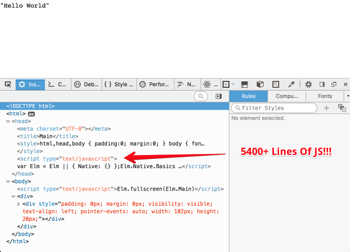
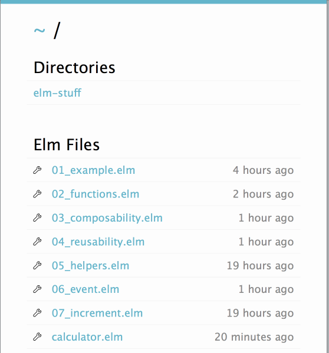
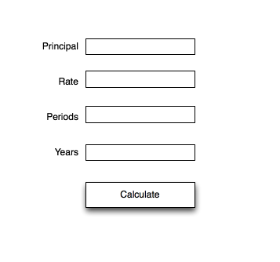

# Rethinking Front End Development With Elm

Brian Hogan


---

### About me


* I build web things.
* I teach people.
* I make music.
* I write books.

----


Elm is a functional programming language like Haskell, but more friendly, and aimed at front-end web development.

We use Elm to make our user interface and give it behavior.

----

### Example

```haskell
import Graphics.Element exposing (show)

main =
  show "Hello World"
```


-----

### Elm compiles to JavaScript

Yes. We just wrote a bunch of code that gets injected into an HTML page.

Feel gross yet?

---

### That's what React does too.

```javascript
var HelloMessage = React.createClass({
  render: function () {
    return <h1>Hello {this.props.message}!</h1>;
  }
});

React.render(<HelloMessage message="World" />, document.body);

```

---

### Okay, Why Elm?

* Same concepts as React
* Pure functions
* Immutable State
* Static Typing


---

### What you need

* Node.js <http://nodejs.org>
   
* The `elm` package for Node

   ```sh
   $ npm install -g elm
   ```

* Your favorite text editor

### OR

<http://elm-lang.org/try>

----

### Compiling Elm

* Create a `hello.elm` file
* Run 

```sh
  $ elm make hello.elm
  Success! Compiled 1 modules.
  Successfully generated index.html
```

* Open resulting `index.html` in your browser.

----

### HTML



----

### Comparison

* Elm: ~5400 lines
* React: ~19300 lines
* Jquery: ~9800 lines


----

### Elm Reactor

Elm Reactor compiles Elm to HTML on each request.

```sh
$ elm-reactor
elm reactor 0.16.0
Listening on http://0.0.0.0:8000/
```




----

### How Elm Works

Every Elm app calls a `main` function when we run it.

```haskell
main = 
  -- something goes here
```

----

### Functions

We define functions with a name followed by an `=` sign.

```haskell
hello = 
  "Hello there"
```

We indent the definitions of functions.

We invoke this function like this:

```haskell
hello
```

---

### Arguments

Functions can have arguments

```haskell
square number = 
  number * number
```

Call it as

```haskell
square 2
```

They have explicit returns.

---

### Multiple Arguments

Multiple arguments use spaces:

```haskell
add number1 number2 =
  number1 + number2
```

Call it as

```haskell
add 1 2
```

Woah.... no commas!

--- 

### Type annotations

We can enforce data types for our functions so Elm can help us out.

```haskell
functionName: TypeOfArg1-> TypeOfArg2 -> TypeOfArg3 -> ReturnType
```


^ The annotation is simply a flow of types, with the last being the return type.


----

### Annotation Examples:

No parameters. Just return value

```haskell
hello: String
hello =
  "Hello there"
```

Two parameters and a return value

```haskell
add: Float -> Float -> Float
add number1 number2 = 
  number1 + number2

```
----

### Modules

Define modules to group your code.

```haskell
module Hello where

main = 
  -- something goes here

```

----

### Html functions

The `elm-html` module exposes many functions for building up virtual DOM nodes.

The `main` function can render HTML if the HTML module is included.

```haskell
import Html exposing(p, text)

main =
  p [] [text "Hello World"]
```

---

### p and text

```haskell
  p [] [text "Hello World"]
```

p and text are two functions from `elm-html`

`p` takes two lists

* a list of attributes (can be empty)
* a list of child elements
     
`text` takes a string of text to display.

----


### HTML functions are uniform.

Each takes attributes and elements. So we can nest them like HTML.

```haskell
div [class "foo", id "bar" ] [
  h1 [] [text "Hello"],
  p [] [text "World"]
] 
```

There's a function for every element. Just be sure to expose what you use.

---

### Seriously uniform

```haskell
label [for "name"] [text "Name"]
input [id "name", type' "number", step "any"] []
```

Even functions for  tags that don't allow inner content still take two lists as arguments.

----

### Html Modules

* `Html` contains all the tags
* `Html.Attributes` contains the attributes (like `class`, `id`, `href`, etc)
* `Html.Events` contains events like `onClick`

----

### Html Attributes

```haskell
import Html exposing(Html, div, text, p)
import Html.Attributes exposing(class)

main =
  div [class "wrapper"] [
    p [class "notice"] [text "This is important!"]
  ]
```

----

### Composability

```haskell
main =
  view
  
view: Html
view =
  div [] [
    p [] [
      text "Hello ", 
      em [] [text "world"]
    ]
  ]
```
^ Using functions means we can break things down.

---

### Resuability

```haskell
main =
  div [] [
    view "Hello",
    view "Goodbye"
  ]
  
view: String -> Html
view word =
  div [] [
    p [] [ text (word ++ " "), em [] [text "world"] ]
  ]
  
```

^ Use arguments to reuse functions.

----


### Web Interfaces

```haskell
import Html exposing(Html, Attribute, p, text)
import Html.Attributes exposing(style)

elementStyle: Attribute
elementStyle =
  style [ ("color", "red") , ("font-size", "2em") ] 

main: Html
main =
  view

view = 
  p [elementStyle] [text "Hello World"]
```

-----

### Helpers!

```haskell
fieldWithLabel: String -> String -> String -> Html
fieldWithLabel fieldID fieldName fieldType =
  div [] [
    label [for fieldID] [text fieldName],
    input [ id fieldID, type' fieldType] []
  ]
```

----

### Build Out The Helpers

```haskell
numberField: String -> String -> Html
numberField fieldID fieldName =
  fieldWithLabel fieldID fieldName "number"

textField: String -> String -> Html
textField fieldID fieldName =
  fieldWithLabel fieldID fieldName "text"
  
emailField: String -> String -> Html
emailField fieldID fieldName =
  fieldWithLabel fieldID fieldName "email"
```

----

### Shiny Happy Frontend Code

```haskell
main: Html
main =
  div [] [
    textField "name" "Name",
    numberField "age" "Age",
    emailField "email" "Email"
  ]
```

----

## Elm Architecture

**View**: Function that fires when model changes. Transofms a model into the UI that people see.

**Model**: Something that holds the current state of the app. No behavior. Just the state. No behavior. _This is not MVC with objects!_

**Update**: Function that fires when state changes. Always returns a _new_ model.

----

## Signals and Mailboxes

### Signals

Signals route messages around the application. Pressing a button is a signal. We can send data along signals.

### Mailboxes

Mailboxes receive signals and send signals. A mailbox has an address and a signal to respond to.

----

### Basic Flow

* Model is initialized
* View is displayed with model
* Events send Signals to Mailboxes
* Mailboxes trigger updates
* New model is created
* New view is rendered

Yikes!

---

### Elm StartApp.Simple

Like Flux, without all the code. 

* Define `Actions`
* Define a `model` to represent data
* Define a `view` function
* Define an `update` function that returns a new `model`.

---

### Change Text On Click

```haskell
import Html exposing (Html, text, h1, p, div, button)
import StartApp.Simple as StartApp
import Html.Events exposing (onClick)

main =
  StartApp.start {model = "Hello ", view = view, update = update}

view address initialText =
  div [] [
    h1 [] [text "Events"],
    p [] [ text initialText ],
    button [onClick address "change"] [text "Push me"]
  ]

update action model =
  "it changed"

```
---


### Actions

Actions get sent to the Update.

```haskell

type Action = Increment | Decrement

model = 0

update: Signal.Action -> Int -> Int
update action model =
  case action of
    Increment -> model + 1
    Decrement -> model - 1
```


---

### Multiple events

```haskell
main =
  StartApp.start { model = model, view = view, update = update }

view: Signal.Address Action -> Int -> Html
view address model =
  div []
    [ button [ onClick address Increment ] [ text "Up" ]
    , span [] [ text (toString model) ]
    , button [ onClick address Decrement ] [ text "Down" ]
    ]
```

---

### Once again...

* `StartApp` renders the view using an initial model state.
* Events defined in the `view` send `Actions`  to `Signal Addresses` which route to  `update`.
* `update` returns a new version of the model
* `StartApp` causes the `view` to be rerendered whenever `model` changes.

----

### Calculator

Compound Interest Calculator

> Write a program to compute the value of an investment compounded over time. The program should ask for the starting amount, the number of years to invest, the interest rate, and the number of periods per year to compound.

$$
A = P\left (1 + \frac{r}{n}  \right )^{nt}
$$


---

### Project setup

Create folder and file to work in

```bash
$ mkdir calculator && cd calculator
$ touch calculator.elm
```

Init the project

```bash
$ elm package install
```

Install HTML and StartApp dependencies.

```bash
$ elm package install evancz/elm-html
$ elm package install evancz/start-app
```

---

### Livereloading

Make browser reload when we save

```sh
$ npm install -g elm-live
$ elm-live calculator.elm
```

----

### Steps

* Create the basic app
* Build the form
* Bind form to model and define events
* Perform calculations
* Display Output

----

### The Basic App

```haskell
import Html exposing (Html, text, h1, p, div, button, label, input)
import Html.Attributes exposing ( style, for, id, step, type', value)
import StartApp.Simple as StartApp
import Html.Events exposing (onClick)

main =
  StartApp.start {model = model, view = view, update = update}
```
----


### Building the form

* Use `label`, `input` functions
* Use `number` fields
* Each field change updates model state
* Clicking button calculates new amount




----

### `numberField` helper

```haskell
numberField: String -> String -> Html
numberField fieldID fieldName =
  div [] [
    label [for fieldID] [text fieldName],
    input [ id fieldID, type' "number", step "any"] []
  ]
```

----

### Style the form

```haskell
labelStyle: Attribute
labelStyle =
  style
    [ ("width", "200px")
    , ("padding", "10px")
    , ("text-align", "right")
    , ("display", "inline-block")
    ]
```

----

### Apply style to field

```haskell
  div [] [
    label [labelStyle, for fieldID] [text fieldName],
    input [ id fieldID, type' "number", step "any"] []
  ]
```

----

### Build the View

```haskell
view: Signal.Address String -> Float -> Html
view address model =
  div [] [
    h1 [] [text "Calculator"],
    div [] [
      numberField "principal" "Principal",
      numberField "rate" "Rate",
      numberField "years" "Periods",
      numberField "years" "Years"
    ]
    button [onClick address "calculate"] [text "Calculate"]
  ]
```

----

### Define Our Actions

```haskell
type Action
  = NoOp
    | SetPrinciple String
    | SetPeriods String
    | SetRate String
    | SetYears String
    | Calculate
```

----

### Define A Model

```haskell
type alias Model =
  { principle: String
  , rate: String
  , years: String
  , periods: String
  , newAmount: Float}

model: Model
model =
  { principle = "1500.00"
  , rate = "4.3"
  , years = "6"
  , periods = "4"
  , newAmount = 0 }
```

----


### Pass address, action, and model data to fields

```haskell
view: Signal.Address Action -> Model -> Html
view address model =
  div [] [
    h1 [] [text "Calculator"],
    div [] [
      numberField address SetPrinciple "principle" "Principle" model.principle,
      numberField address SetRate "rate" "Rate" model.rate,
      numberField address SetPeriods "periods" "Periods" model.periods,
      numberField address SetYears "years" "Years" model.years
    ],
    button [onClick address Calculate] [text "Click me"],
```

----

### Add Events To Form using Actions and model data

```haskell
numberField: Signal.Address Action -> (String -> Action) -> 
             String -> String -> String -> Html
numberField address action fieldID name fieldValue =
  div [] [
    label [labelStyle, for fieldID] [text name],
    input [id fieldID, type' "number", step "any",
        on "input" targetValue (Signal.message address << action ),
        value fieldValue] []
  ]
```

----

### Update model from form

```haskell
update: Action -> Model -> Model
update action model =
  case action of
    NoOp -> model

    SetPrinciple p -> {model | principle = p}

    SetRate r -> {model | rate = r}

    SetYears y -> {model | years = y}

    SetPeriods p -> {model | periods = p}

    Calculate -> calculateNewAmount model
```

----

### The program Logic

$$
A = P\left (1 + \frac{r}{n}  \right )^{nt}
$$

```haskell
compoundInterest: Float -> Float -> Float -> Float -> Float
compoundInterest principle rate periods years =
  (principle * (1 + (rate / periods ) ) ^ (years * periods) )
```

----

### Converting Strings To Floats

```haskell
convertToFloat: String -> Float
convertToFloat string =
  case String.toFloat string of
    Ok n -> n
    Err _ -> 0.0
```

----

### Implement CalculateNewAmount

```haskell
calculateNewAmount: Model -> Model
calculateNewAmount model =
  let
    rate = convertToFloat model.rate / 100
    years = convertToFloat model.years
    principle = convertToFloat model.principle
    periods = convertToFloat model.periods
  in
    {model | newAmount = (compoundInterest principle rate periods years) }
```

----

### Display the Output

```haskell
output: Model -> Html
output model =
  div [] [
    span [] [text "Amount: "],
    span [] [text (toString model.newAmount) ]
  ]
```

And add it to the view.

----

### Discuss

What are your thoughts?

Is this cool? Good? Bad? A terrible idea or the greatest thing ever?


----

### Issues

1. Tons of code to do simple thins
2. Integration with external services is complex.
3. Must re-learn a lot of things about web development
4. Small community


----

### Benefits
1. Small community
2. Benefits of React with a clear opinionated approach
3. Fantastic error messages
4. Types ensure data integrity and flow


---

### Write code

* Elm website: <http://elm-lang.org/>
* Try Elm <http://elm-lang.org/try>
* Package system: <http://package.elm-lang.org/>
* Documentation <http://elm-lang.org/docs>


----

### Where to go next?


Book: <http://pragprog.com/titles/bhwb>

Twitter: [@bphogan](http://twitter.com/bphogan)

Material: <http://bphogan.com/presentations/elm2016/>


### Thank you!

© Brian Hogan, 2016. 
Photos from http://pexels.com
