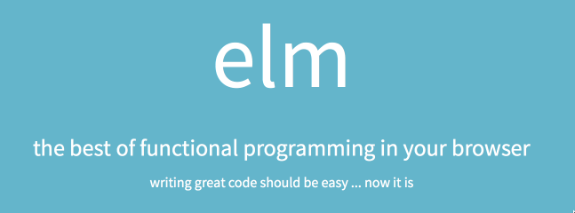

# Rethinking Front End Development With Elm

Brian Hogan


---

## About me


* I build web things.
* I teach people.
* I make music.
* I write books.

----




Elm is a functional programming lnaguage like Haskell, but more friendly, and aimed at front-end web development.

We use Elm to make our user interface and give it behavior.

---


## Example

```
module Hello where

import Html exposing(p, text)
import Html.Attributes exposing(style)

elementStyle =
  style 
    [ ("color", "red")
    , ("font-size", "2em")
    ]


main =
  p [elementStyle] [text "Hello World"]
```

-----

## Elm compiles to JavaScript

Yes. We just wrote a bunch of code that gets injected into an HTML page.

Feel gross yet?

---

## That's what React does too.

```
var HelloMessage = React.createClass({
  render: function () {
    return <h1>Hello {this.props.message}!</h1>;
  }
});

React.render(<HelloMessage message="World" />, document.body);

```

---

## Okay, Why Elm?

* Same concepts as React
* Pure functions
* Immutable State
* Static Typing


----

## Working with HTML

Elm's virtual DOM support is separate:

```
$ elm package install evancz/elm-html
```

Make browser reload when we save

```
$ npm install -g elm-live
```

----

## Main

Every Elm app calls a `main` function when we run it.

```
main = 
  -- something goes here
```

We indent the definitions of functions.

----

## Functions

```
hello = 
  "Hello there"
```

Call it as

```
hello
```

---

## Arguments

Functions can have arguments

```
square number = 
  number * number
```

Call it as

```
square 2
```

They have explicit returns.

---

## Multiple Arguments

Multiple arguments use spaces:

```
add number1 number2 =
  number1 + number2
```

Call it as

```
add 1 2
```


---

## Html

The `main` function can render HTML if the HTML module is included.

```
import Html exposing(p, text)


main =
  p [] [text "Hello World"]
```
---

## p and text

```
  p [] [text "Hello World"]
```

p and text are two functions

`p` takes two lists
* a list of attributes
* a list of child elements
     
`text` takes a string of text to display.

----

## HTML functions are uniform.

```
div [class "foo", id "bar" ] [
  h1 [] [text "Hello"],
  p [] [text "World"]
] 
```
Each takes attributes and elements. So we can nest them like HTML.


----

## Composability

```
main =
  view
  

view =
  div [] [
     p [
       text "Hello ", 
       em "world"
     ]
  ]
```

---

## Resuability

```
main =
  div [] [
    view "Hello",
    view "Goodbye"
  ]
  

view word =
  div [] [
     p [
       text (word ++ " "), 
       em "world"
     ]
  ]
```


----

## Elm Architecture

### View

Function that fires when model changes. Transofms a model into the UI that people see.

### Model

State of the app. No behavior. Just the state.

### Update

Function that fires when state changes. Always returns a _new_ model.

----

## Signals and Mailboxes

## Signals

Signals route messages around the application. Pressing a button is a signal. We can send data along signals.

## Mailboxes

Mailboxes receive signals and send signals. A mailbox has an address and a signal to respond to.


---

## Basic Flow

* Model is initialied
* View is displayed with model
* Events send Signals to Mailboxes
* Mailboxes trigger updates
* New model is created
* New view is rendered

---

## Elm StartApp.Simple

Simple pattern we use to hide much of the details.

Like Flux, without all the code.

---

## Example

```
type Action = Increment | Decrement

main =
  StartApp.start { model = model, view = view, update = update }

model = 0

view address model =
  div []
    [ button [ onClick address Decrement ] [ text "-" ]
    , div [] [ text (toString model) ]
    , button [ onClick address Increment ] [ text "+" ]
    ]

update action model =
  case action of
    Increment -> model + 1
    Decrement -> model - 1
```

---

## Calculator

Compound Interest Calculator

> Write a program to compute the value of an investment compounded over time. The program should ask for the starting amount, the number of years to invest, the interest rate, and the number of periods per year to compound.

$$
A = P\left (1 + \frac{r}{n}  \right )^{nt}
$$


---


## What you need

* Node.js <http://nodejs.org>
   
   ```
   $ npm install -g elm
   ```
   
* The `elm` package for Node
* Your favorite text editor


---

## Project setup

Create folder and file to work in

```
$ mkdir calculator && cd calculator
$ touch calculator.elm
```

Init the project

```
$ elm package install
```

Install HTML and StartApp

```
$ elm package install evancz/elm-html
$ elm package install evancz/start-app
```

---


## Demo

* Create the basic app
* Build the form
* Perform calculations

----

## Issues

1. Tons of code to do simple thins
2. Integration with external services is complex.
3. Must re-learn a lot of things about web development
4. Small community


---

## Benefits
1. Small community
2. Benefits of React with a clear opinionated approach
3. Fantastic error messages
4. Types ensure data integrity and flow


---

## Write code

* Elm website: <http://elm-lang.org/>
* Try Elm <http://elm-lang.org/try>
* Package system: <http://package.elm-lang.org/>
* Documentation <http://elm-lang.org/docs>


----

## Where to go next?


Book: <http://pragprog.com/titles/bhwb>

Twitter: [@bphogan](http://twitter.com/bphogan)

Material: <http://bphogan.com/presentations/elm2016/>


## Thank you!